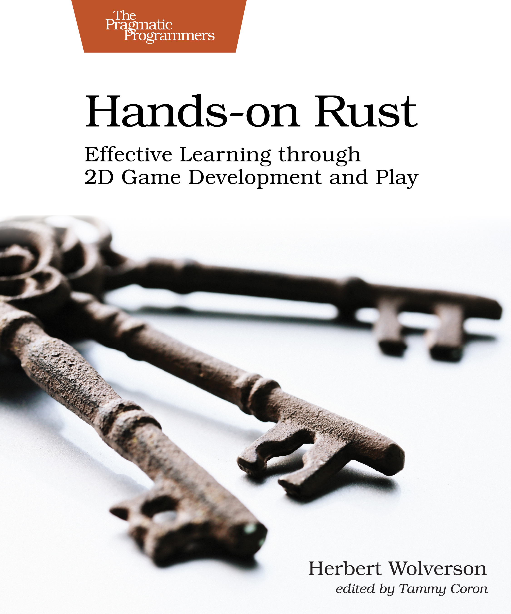

# Hands-on Rust Source Code

This repository contains the source code for the examples found in [Hands-on Rust](https://hands-on-rust.com/). These are also available from my publisher, [PragProg](https://pragprog.com/titles/hwrust/hands-on-rust/) and are shared with their permission.

The examples included are:

**Installing Rust**

This code covers the *Rust and Your Development Environment* chapter. It is designed to help you get a working Rust toolchain together, and understand the tools Rust provides.

* [Hello World](https://github.com/thebracket/HandsOnRust/tree/main/InstallingRust/HelloWorld)---the obligatory first Rust program we all encounter.
* [Clippy](https://github.com/thebracket/HandsOnRust/tree/main/InstallingRust/Clippy)---an example showing `Clippy` in action, finding a common issue.
* [Clippy Fixed](https://github.com/thebracket/HandsOnRust/tree/main/InstallingRust/ClippyFixed)---the Clippy example, now working without suggestions.

**First Steps with Rust**

This code covers the *First Steps with Rust* chapter. It is designed to teach language basics.

* [Hello Your Name](https://github.com/thebracket/HandsOnRust/tree/main/FirstStepsWithRust/hello_yourname)---First example, prompting the user for their name, storing it in a variable and printing it.
* [Hello Your Name Function](https://github.com/thebracket/HandsOnRust/tree/main/FirstStepsWithRust/hello_yourname_function)---Move obtaining names into a function.
* [Trimming - The Problem](https://github.com/thebracket/HandsOnRust/tree/main/FirstStepsWithRust/treehouse_guestlist_problem)---Demonstrates how `\n` and other control codes can be captured in standard input.
* [Trimming](https://github.com/thebracket/HandsOnRust/tree/main/FirstStepsWithRust/treehouse_guestlist_trim)---Demonstrates how to sanitize user input.
* [Treehouse Guestlist](https://github.com/thebracket/HandsOnRust/tree/main/FirstStepsWithRust/treehouse_guestlist)---teaches how to store data in an array and search it.
* [Treehouse Structs](https://github.com/thebracket/HandsOnRust/tree/main/FirstStepsWithRust/treehouse_guestlist_struct)---learn to store guest information in a struct, and iterate/search arrays of structs.
* [Treehouse Vectors](https://github.com/thebracket/HandsOnRust/tree/main/FirstStepsWithRust/treehouse_guestlist_vector)---expand the treehouse by using a `Vec` for guest storage.
* [Treehouse Enums](https://github.com/thebracket/HandsOnRust/tree/main/FirstStepsWithRust/treehouse_guestlist_enum)---learn to use Rust's `enum` system, and `match` on results.

**Build Your First Game with Rust**

This code covers the *Build Your First Game with Rust* chapter. It takes the knowledge from the previous two chapters and helps you make your first game, *Flappy Dragon*.

* [Hello, Bracket Terminal](https://github.com/thebracket/HandsOnRust/tree/main/FirstGameFlappyAscii/hello_bterm)---import that `bracket-lib` crate, learn about dependencies and writing to the screen.
* [Flappy States](https://github.com/thebracket/HandsOnRust/tree/main/FirstGameFlappyAscii/flappy_states)---learn to manage the overall structure of the game with states.
* [Flappy Player](https://github.com/thebracket/HandsOnRust/tree/main/FirstGameFlappyAscii/flappy_player)---add a player to the game, flapping on command.
* [Flappy Dragon](https://github.com/thebracket/HandsOnRust/tree/main/FirstGameFlappyAscii/flappy_dragon)---your first playable game, an ASCII mode Flappy Dragon game.
* [Flappy Bonus](https://github.com/thebracket/HandsOnRust/tree/main/FirstGameFlappyAscii/flappy_bonus)---Bonus content, showing Flappy Dragon with graphics and smooth movement.

*Flappy Bonus* has an accompanying bonus [online tutorial](https://hands-on-rust.com/2021/02/08/from-flappy-dragon-to-flappy-bonus/).

**Build a Dungeon Crawler**

This code covers the *Build a Dungeon Crawler* chapter. It starts a new game that will form the basis of the remainder of the book.

* [Dungeon Map](https://github.com/thebracket/HandsOnRust/tree/main/BasicDungeonCrawler/dungeon_crawl_map)---helps you organize your code into modules, build a blank map, and understand tile map storage.
* [Dungeon Player](https://github.com/thebracket/HandsOnRust/tree/main/BasicDungeonCrawler/dungeon_crawl_player)---adds a player who can walk around the map, introducing game-loop based input handling, state management and interactions between structures.
* [Dungeon Rooms](https://github.com/thebracket/HandsOnRust/tree/main/BasicDungeonCrawler/dungeon_crawl_rooms)---introduces using algorithms to build a basic dungeon map, and the concept of a map builder API.
* [Dungeon Graphics](https://github.com/thebracket/HandsOnRust/tree/main/BasicDungeonCrawler/dungeon_crawl_graphics)---adds tile-based rendering to the game, giving you a dungeon you can walk around.

**Compose Dungeon Denizens**

This code covers the *Compose Dungeon Denizens* chapter. It introduces the Entity-Component System architecture and focuses on composing dungeon elements from reusable parts.

* [Player ECS](https://github.com/thebracket/HandsOnRust/tree/main/EntitiesComponentsAndSystems/playerecs)---converts the simple player handler to use entities, components and systems. Introduces multi-file modules and using procedural macros. Demonstrates fearless concurrency, and how easy Rust can make it to benefit from concurrency.
* [ECS Monsters](https://github.com/thebracket/HandsOnRust/tree/main/EntitiesComponentsAndSystems/dungeonecs)---walks you through using the same systems to support monsters in your game. Adds initial collision detection, allowing you to kill monsters by walking into them.

**Take Turns with the Monsters**

This code covers the *Take Turns with the Monsters* chapter. It expands upon game states by transitioning between states and implementing a turn-based game structure.

* [Wandering Monsters](https://github.com/thebracket/HandsOnRust/tree/main/TurnBasedGames/wandering)---Introduces code to make the monsters wander randomly through the dungeon.
* [Turn Based](https://github.com/thebracket/HandsOnRust/tree/main/TurnBasedGames/turnbased)---applies state management to make the game turn based. You move, then the monsters move.
* [Messages of Intent](https://github.com/thebracket/HandsOnRust/tree/main/TurnBasedGames/intent)---introduces using the ECS to store messages of intent, allowing you to separate functionality between systems and use the underlying storage system as a messaging system. Makes monsters and the player use the same system to *apply* movement, but with different movement inputs.

**Health and Melee Combat**

This code covers the *Health and Melee Combat* chapter. It adds health to both the player and monsters, and implements a simple combat system. It also adds a heads-up display to show the current game status. It emphasizes code re-use.

* [Health](https://github.com/thebracket/HandsOnRust/tree/main/HealthSimpleMelee/health)---adds hit points to the game and adds health display. It also introduces the concept of rendering layers, tooltips and naming entities.
* [Combat](https://github.com/thebracket/HandsOnRust/tree/main/HealthSimpleMelee/combat)---allows you to damage monsters by bumping into them, and lets them damage the player.
* [Healing](https://github.com/thebracket/HandsOnRust/tree/main/HealthSimpleMelee/healing)---introduces health restoration, initially by waiting.

**Victory and Defeat**

This code covers the *Victory and Defeat* chapter. It adds winning and losing conditions to the game.

* [The Gauntlet](https://github.com/thebracket/HandsOnRust/tree/main/WinningAndLosing/gauntlet)---all about trait implementation, and using traits to make Dijkstra Maps work. Monsters path towards the player.
* [Losing](https://github.com/thebracket/HandsOnRust/tree/main/WinningAndLosing/losing)---detect when the player is dead, and use a game state to display a "you lost" message. Offer to play again, resetting the game state.
* [Winning](https://github.com/thebracket/HandsOnRust/tree/main/WinningAndLosing/winning)---adds an amulet to the map. When the player reaches the amulet, the game state changes to a "you won" screen.

**Fields of View**

This code covers the *Fields of View* chapter. It implements traits to provide functionality from `bracket-lib`---specifically fields of view. It then limits monsters to chasing what they can see, and adds spatial memory.

* [Field of View](https://github.com/thebracket/HandsOnRust/tree/main/WhatCanISee/fov)---introduces the concept of vision, and implements it via traits. Limits the player to displaying only what they can currently see.
* [Monstrous Eyesight](https://github.com/thebracket/HandsOnRust/tree/main/WhatCanISee/eyesight)---adds fields of view to monsters, reusing the same code. Monsters now only chase the player when they can see it.
* [Memory](https://github.com/thebracket/HandsOnRust/tree/main/WhatCanISee/memory)---keep track of where you've been with a dungeon map memory system. Show areas you've previously visited, but not areas you've yet to discover.

**More Interesting Dungeons**

This code covers the *More Interesting Dungeons* chapter. It teaches the reader to create new traits, and use them interchangeably via a trait interface. It covers various popular procedural generation techniques, providing tips and tricks along the way.

* [Traits](https://github.com/thebracket/HandsOnRust/tree/main/MoreInterestingDungeons/traits)---convert map generation into a trait-based API and dynamically select algorithms at run-time.
* [Traits: Rooms](https://github.com/thebracket/HandsOnRust/tree/main/MoreInterestingDungeons/traits_rooms)---convert your existing room generator to a trait-based map builder.
* [Cellular Automata](https://github.com/thebracket/HandsOnRust/tree/main/MoreInterestingDungeons/cellular)---implement your first real map provider, and learn to use Cellular Automata to make an interesting map.
* [Drunkard's Walk](https://github.com/thebracket/HandsOnRust/tree/main/MoreInterestingDungeons/cellular)---implement a second map generation technique, and learn about bounded iteration.
* [Prefabs](https://github.com/thebracket/HandsOnRust/tree/main/MoreInterestingDungeons/prefab)---learn to hand design your own level content, and apply it.
* [Test Harness](https://github.com/thebracket/HandsOnRust/tree/main/MoreInterestingDungeons/output_harness)---a convenient structure for testing map builders without having to play the game over and over. Demonstrates the utility of making traits generic and then building separate harnesses in which to test them.

**Map Themes**

This code covers the *Map Themes* chapter. It extends upon reusable traits by creating a generic rendering system that can visually theme any level to the tileset of your choice.

* [Themed Maps](https://github.com/thebracket/HandsOnRust/tree/main/MapTheming/themed)---separates the dungeon graphics into one theme, and adds a forest map theme.

**Inventory and Power-Ups**

This code covers the *Inventory and Power-Ups* chapter. It teaches you to build items with composition, manage their storage and implement item interactions.

* [Potions and Scrolls](https://github.com/thebracket/HandsOnRust/tree/main/InventoryAndPowerUps/potions_and_scrolls)---Learn to implement items, reusing a lot of existing code. Adds health potions and a magic mapping item to the game.
* [Carrying Items](https://github.com/thebracket/HandsOnRust/tree/main/InventoryAndPowerUps/carrying_items)---learn to use components to represent an item in inventory, and iterate it to display the player's inventory. Use carried items when you want to.

**Deeper Dungeons**

This code covers the *Deeper Dungeons* chapter. It extends your data storage system to provide for multi-level dungeons, with the end-game item only appearing on the final level.

* [More Levels](https://github.com/thebracket/HandsOnRust/tree/main/DeeperDungeons/more_levels)---is about making more dungeon levels, showing you how your game structure is reusable and can readily be extended into a deeper game.

**Combat Systems and Loot**

This code covers the *Combat Systems and Loot* chapter. Learn to design your entities as *data*---in TOML files. Learn to de-serialize the files, and use them as templates to spawn items and monsters.

* [Loot Tables](https://github.com/thebracket/HandsOnRust/tree/main/Loot/loot_tables)---introduces serialization with `Serde`, and the power it provides for quickly extending your game. Migrate your monsters to simple data files, allowing for quick iteration of new baddies.
* [Better Combat](https://github.com/thebracket/HandsOnRust/tree/main/Loot/better_combat)---further extends the data-driven aspects of the game by letting you design weapons and change monster difficulty. Change how monsters spawn, providing for a difficulty curve.
